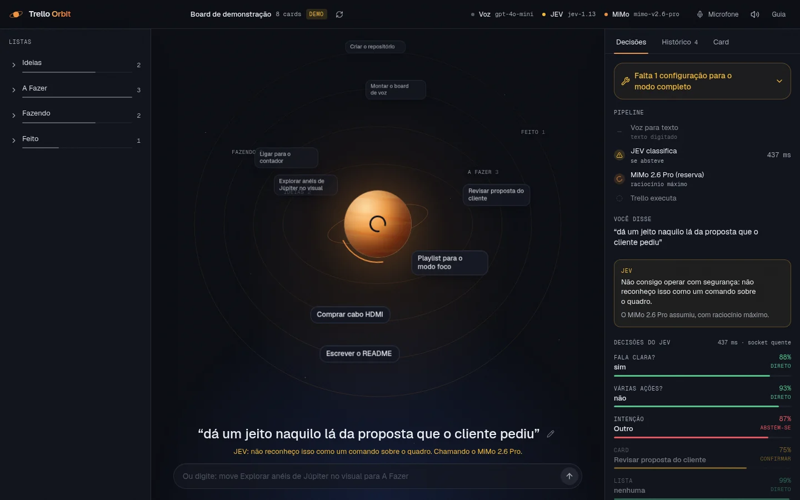

# 🪐 Trello Orbit

**Pilote seu board do Trello por voz.** Você fala → a **OpenAI** transcreve → o **JEV** (modelo
"System One" da TypeSafe, via OpenRouter) decide a intenção, o card e a lista em **~0,4 s** → o app
executa pela API do Trello e responde em áudio. O **MiMo 2.6 Pro** só entra quando o próprio JEV diz
que não consegue operar com segurança.


> O card que você cita **vem para perto** do planeta; ao lado, o painel mostra o pipeline com os
> tempos reais e cada decisão do JEV com a sua confiança.

---

## Índice

- [O que ele faz](#o-que-ele-faz)
- [JEV primeiro, MiMo de reserva](#jev-primeiro-mimo-de-reserva)
- [Microfone: como funciona e como diagnosticar](#microfone-como-funciona-e-como-diagnosticar)
- [Início rápido (sem nenhuma chave)](#início-rápido-sem-nenhuma-chave)
- [Configuração completa (.env)](#configuração-completa-env)
- [Credenciais passo a passo](#credenciais-passo-a-passo)
- [Comandos de voz](#comandos-de-voz)
- [API do servidor](#api-do-servidor)
- [Design, animações e acessibilidade](#design-animações-e-acessibilidade)
- [Estrutura do repositório](#estrutura-do-repositório)
- [Testes e verificação](#testes-e-verificação)
- [Publicação sem vazar credenciais](#publicação-sem-vazar-credenciais)
- [Segurança](#segurança)
- [Solução de problemas](#solução-de-problemas)
- [Licença](#licença)

---

## O que ele faz

### Fluxo completo

1. **Você toca no planeta** (ou aperta `Espaço`) e fala. O app **para de ouvir sozinho** quando você
   termina (detecção de fala) e envia só o trecho com voz.
2. A **API STT da OpenAI** transcreve (`gpt-4o-mini-transcribe`), recebendo o nome das suas listas e
   cards como dica de vocabulário.
3. O **JEV** classifica tudo numa única chamada paralela: intenção, card, lista, "é uma ação só?",
   "a fala está clara?". Código determinístico extrai o que o JEV não gera (títulos, datas).
4. Se o JEV opera, o plano sai em **~0,4 s**. Se ele se abstém (confiança < 50%, fala ininteligível,
   pedido composto dependente…), a tela **mostra o motivo na hora** e o **MiMo 2.6 Pro** (raciocínio
   máximo) assume.
5. **Mover, prazo, comentar…** executam direto quando a confiança é alta; confiança média pede um
   ok; **criar/apagar sempre confirmam** (apagar só segurando o botão). Você pode confirmar **por
   voz** («sim», «cancela»): o JEV classifica a resposta.
6. O servidor aplica na **API REST do Trello** (ou num board demo) e o app responde em áudio.

Tudo funciona **sem chaves**: o app degrada com elegância (STT do navegador · interpretador local
pt-BR · board de demonstração) e mostra no painel exatamente o que falta.

### Ações suportadas na API do Trello

| Ação | Com a voz | Confirmação? |
|---|---|---|
| Criar card (nome, lista, descrição, prazo, etiquetas) | «cria card X na lista Y com prazo amanhã» | ✅ sempre |
| Apagar card (definitivo) | «apaga o card X» | ✅ sempre (hold-to-confirm) |
| Mover card entre listas | «move X para fazendo» | não (narra e executa) |
| Editar card (nome, descrição, etiquetas) | «renomeia X para Y» / «coloca etiqueta urgente em X» | não |
| Definir/remover prazo (+ concluir prazo) | «coloca prazo sexta no card X» | não |
| Comentar no card | «comenta revisado no card X» | não |
| Arquivar card | «arquiva o card X» | não |
| Criar lista | «cria lista chamada Espera» | não |
| Adicionar item a checklist | «adiciona revisar contrato ao checklist de X» | não |
| Consultar o board | «o que eu tenho para fazer?» | — (só responde) |

O servidor também expõe **`GET /api/trello/boards`** (lista seus boards, útil para achar o
`TRELLO_BOARD_ID`) e trata erros da API do Trello com códigos claros
(`trello_unauthorized`, `trello_not_found`, …).

---

## JEV primeiro, MiMo de reserva

O **JEV** não é um LLM: é um modelo *System One* que recebe um texto + perguntas tipadas e devolve
**decisões com probabilidades calibradas**, sem gerar texto. As perguntas de uma chamada são avaliadas
**em paralelo dentro do modelo** (~0,4 s no total, ~US$ 0,0001 por comando). Por isso cada comando
vira **uma** requisição, nunca uma cadeia:

| Pergunta (tipo) | Para quê |
|---|---|
| **Intenção** (`choice`: criar, apagar, mover, prazo, concluir, renomear, comentar, arquivar, lista, checklist, consultar, outro) | decide o que fazer |
| **Card** (`choice` entre os cards abertos do board, ≤ 255) | resolve "o contador" → *Ligar para o contador* |
| **Lista** (`choice` entre as listas) | destino de mover / onde criar |
| **Tipo de consulta** (`choice`) | "o que tenho?" vs. "o que há em Fazendo?" |
| **Fala clara?** · **Várias ações?** (`noul`) | *guardas*: só bloqueiam, nunca pedem confirmação por incerteza leve |

O que o JEV **não** faz fica com código: título do card, datas ("dia 20", "semana que vem") e texto
de comentário. Comandos compostos (*«move A para fazendo e apaga B»*) são divididos em cláusulas e
**cada uma vai ao JEV em paralelo**.

**Bandas de confiança** (`JEV_AUTO_THRESHOLD`, padrão 0,80): `auto` executa · `hitl` (0,50–0,79) pede um
ok · `abstain` (< 0,50) passa a vez ao **MiMo 2.6 Pro**, que roda com raciocínio máximo. Criar e
apagar confirmam sempre. Se o JEV ficar indisponível (créditos, rede, 5xx) acontece o mesmo e o motivo
aparece na tela.



O `/api/agent?stream=1` transmite eventos (SSE): o veredito do JEV chega em ~0,5 s mesmo que o MiMo
leve 8 s depois. Medido pelo túnel público: veredito em **0,9 s**, plano final em 9,1 s.

**Calibração** (`npm run eval:jev`, usa o board demo e chamadas reais): 26 de 27 corretos, 1 abstenção,
**0 ações erradas**, p50 ≈ 425 ms. Abster-se é seguro (o MiMo resolve); agir errado é o único erro grave,
e o eval falha se acontecer. Rode-o sempre que mexer nas perguntas em `services/jev-planner.js`.

---

## Microfone: como funciona e como diagnosticar

A captura **não usa `MediaRecorder`** (webm/opus, a fonte clássica de "nunca transcreve"): o áudio é
capturado como **PCM via AudioWorklet** e enviado como **WAV 16 kHz mono**.

- **Para sozinho**: detecção de fala com piso de ruído calibrado (um ventilador constante vira
  "fundo", não "fala"). Fala e ~1,1 s de silêncio encerram a gravação.
- **Aparas e ganho**: só o trecho com voz sobe (menos bytes, STT mais rápido) e microfones baixos
  ganham até 10× de volume.
- **Diz por que falhou**: dispositivo mudo (*«O microfone «X» não captou som»*), sem fala, permissão
  negada, microfone em uso. Gravação muda **nem chega à OpenAI**.
- **Menu do microfone** (barra superior): escolha o dispositivo, ative **áudio bruto** (sem
  cancelamento de eco/ruído) e use o **medidor de nível ao vivo** para ver se ele capta algo.
- **Duas vias de transcrição**: a legenda ao vivo do navegador (quando existe) aparece enquanto você
  fala e vira reserva se a OpenAI falhar.
- **Atalhos**: `Espaço` fala/para · `Esc` cancela · `Enter` confirma (apagar exige segurar o botão).

---

## Início rápido (sem nenhuma chave)

Requisitos: **Node.js 20+** e npm.

```bash
# 1) dependências
cd server && npm install
cd ../web  && npm install && npm run build

# 2) configuração (pode deixar tudo em branco — modo demo)
cd .. && cp .env.example .env

# 3) subir
cd server && npm start
# ✦ Trello Orbit · http://localhost:8787
```

Abra <http://localhost:8787> — você já verá o board de demonstração em órbita e poderá falar ou
digitar comandos. Nada fica rodando depois que você dá `Ctrl+C`.

Para desenvolver o front com hot reload: `cd web && npm run dev` (Vite na porta 5173, com proxy
para a API em `:8787`).

---

## Configuração completa (.env)

Tudo vive em **um único arquivo** (`/.env`), lido **só pelo servidor**. O `.env.example` documenta
cada campo:

| Variável | O que faz | Onde obter |
|---|---|---|
| `PORT` | porta do servidor (padrão `8787`) | — |
| `APP_URL` / `APP_NAME` | atribuição enviada ao OpenRouter | — |
| `OPENAI_API_KEY` | transcrição de voz (STT) | [platform.openai.com/api-keys](https://platform.openai.com/api-keys) |
| `OPENAI_STT_MODEL` | `gpt-4o-mini-transcribe` (padrão), `gpt-4o-transcribe` ou `whisper-1` | — |
| `OPENAI_STT_LANGUAGE` | idioma da transcrição (padrão `pt`) | — |
| `OPENROUTER_API_KEY` | **JEV** (classificação) **e** MiMo (reserva): a mesma chave serve aos dois | [openrouter.ai/keys](https://openrouter.ai/keys) |
| `JEV_ENABLED` | `false` desliga o JEV (vai direto ao MiMo) | — |
| `JEV_MODEL` | padrão `typesafe/jev-1.13` (use `~typesafe/jev-latest` para acompanhar versões) | — |
| `JEV_AUTO_THRESHOLD` / `JEV_HITL_THRESHOLD` | bandas: `auto` ≥ 0,80 · `hitl` ≥ 0,50 · abaixo disso o JEV se abstém | — |
| `JEV_TIMEOUT_MS` | tempo máximo do JEV antes de cair no MiMo (padrão `4000`) | — |
| `OPENROUTER_MODEL` | modelo de **reserva**: padrão `xiaomi/mimo-v2.6-pro` | — |
| `OPENROUTER_REASONING_EFFORT` | esforço de raciocínio: `max` (padrão) · `xhigh` · `high` · `medium` · `low` · `minimal` · `none` | — |
| `OPENROUTER_MAX_TOKENS` | teto de saída (inclui reasoning tokens), padrão `16000` | — |
| `OPENROUTER_MAX_PROMPT_PRICE` / `..._COMPLETION_PRICE` | teto de custo opcional (USD por 1M tokens) | — |
| `TRELLO_API_KEY` | chave da API do Trello | [trello.com/power-ups/admin](https://trello.com/power-ups/admin) |
| `TRELLO_API_TOKEN` | token com escopo `read, write` | gerado pelo link "Token" no mesmo painel |
| `TRELLO_BOARD_ID` | qual board controlar | `GET /api/trello/boards` |

**Nenhuma dessas variáveis chega ao navegador.** O front conversa apenas com `/api/*`.

---

## Credenciais passo a passo

**➡️ Tutorial completo guiado (com links, `curl`, troubleshooting e segurança):**
**[`docs/TRELLO-GUIA-COMPLETO.md`](docs/TRELLO-GUIA-COMPLETO.md)** — baseado em pesquisa profunda
com verificação adversarial (evidência em [`pesquisas/trello-setup-api.md`](pesquisas/trello-setup-api.md)).

Guia visual complementar: **[`docs/PROXIMOS-PASSOS.html`](docs/PROXIMOS-PASSOS.html)**.

Resumo do Trello (a parte manual):

1. [trello.com/power-ups/admin](https://trello.com/power-ups/admin) → **New** → dê um nome (ex.: *Trello Orbit*).
2. Menu **API Key** → **Generate a new API key** → isso é o `TRELLO_API_KEY`.
3. Link **Token** logo abaixo → autorize com escopo **read, write** → isso é o `TRELLO_API_TOKEN`.
4. Com key + token no `.env`, chame `curl "http://localhost:8787/api/trello/boards"` e copie o `id`
   do board desejado para `TRELLO_BOARD_ID`.
5. Reinicie o servidor — o selo "modo demo" some do cabeçalho.

---

## Comandos de voz

O JEV entende linguagem natural, inclusive verbos coloquiais (*«põe», «joga», «vai pra», «exclui»*) e
menções parciais (*«o contador»* → *Ligar para o contador*). O interpretador local, último degrau da
escada, cobre a gramática essencial em pt-BR:

| Fale algo como | Resultado |
|---|---|
| «cria um card chamado comprar cabo hdmi na lista a fazer com prazo amanhã» | cria (com confirmação) |
| «apaga o card revisar proposta» | apaga (com confirmação + hold) |
| «move revisar proposta para fazendo» | move |
| «coloca prazo sexta no card revisar proposta» | define prazo |
| «comenta revisado no card revisar proposta» | comenta |
| «arquiva o card comprar cabo hdmi» | arquiva |
| «cria uma lista chamada Espera» | cria lista |
| «o que eu tenho para fazer?» | resume o board em áudio |

Datas aceitas: *hoje, amanhã, depois de amanhã, semana que vem, sexta(-feira), dia 20, 20/08,
20 de agosto*, com ou sem hora (*«às 18h»*).

> A caixa de texto abaixo do botão aceita os mesmos comandos — alternativa permanente à voz
> (e a razão de o app ser 100% utilizável sem microfone).

---

## API do servidor

| Método | Rota | Descrição |
|---|---|---|
| `GET` | `/api/health` | liveness |
| `GET` | `/api/status` | capacidades ativas + checklist do que falta configurar |
| `GET` | `/api/board` | snapshot do board (cache de 30 s; `?fresh=1` força releitura) |
| `POST` | `/api/warm` | aquece o socket do JEV e o board (chamado quando a gravação começa) |
| `POST` | `/api/stt` | multipart `audio` (WAV/webm/…) → transcrição (OpenAI STT) |
| `POST` | `/api/agent` | `{ transcript, context? }` → plano `{ speech, actions[], needsConfirmation, band, trace }`; com `?stream=1` responde em **SSE** (`jev` → `mimo` → `plan`) |
| `POST` | `/api/confirm` | `{ text }` → `yes` \| `no` \| `unclear` (o JEV classifica o «sim»/«cancela» falado) |
| `POST` | `/api/actions` | `{ actions[], confirmed }` → executa; **428** se criar/apagar sem `confirmed: true` |
| `GET` | `/api/trello/boards` | lista boards (para achar o `TRELLO_BOARD_ID`) |

Contrato de erro estável em todas as rotas:

```json
{ "error": { "code": "missing_openai_key", "message": "…", "hint": "…", "detail": null } }
```

---

## Design, animações e acessibilidade

- **Tela cheia, de verdade**: o palco orbital ocupa **toda a área livre**. Os anéis são elipses que
  vão até as bordas (geometria recalculada a cada resize; cada anel só recebe os cards que cabem na
  sua circunferência, o resto vira um marcador **+N** e fica no trilho de listas).
- **HUD em três zonas**: trilho esquerdo com **todas** as listas e cards · palco com o planeta ·
  trilho direito com **Decisões** (pipeline ao vivo + o que o JEV decidiu, pergunta por pergunta),
  **Histórico** e **Card**. Abaixo de 1280 px o trilho esquerdo vira a aba *Listas*; no celular os
  painéis descem para baixo do palco.
- **Zero re-render por frame**: um único loop `requestAnimationFrame` posiciona todos os cards
  direto no DOM (profundidade: frente maior e nítida, fundo menor e apagado; pausa suave no hover).
- **O card citado vem para perto**: flutua acima do planeta com brilho, enquanto o resto escurece.
  **Criar** nasce do planeta com eco + **confete**; **apagar** dissolve com blur.
- **Confirmação inline**: nada de modal bloqueando a órbita. Apagar usa *hold-to-confirm*.
- **Planeta = botão de gravar**: bandas de Júpiter, reage ao volume da voz e tem um estado por fase
  (ouvindo, pensando, confirmando…).
- **Sistema visual**: um único acento (cobre) sobre azul-noite com grão sutil, **Geist** e Geist Mono
  self-hosted (`@fontsource-variable`), números tabulares, Tailwind v4 com tokens shadcn semânticos
  (`web/src/index.css`) e **Motion UI** (`toast-stack`, `confetti`, `hold-to-confirm`,
  `multi-state-button`, tema em `motion.theme.ts`).
- **Acessibilidade**: `prefers-reduced-motion` congela a órbita (tudo segue legível), `aria-live` no
  estado do fluxo, papéis `tablist`/`alertdialog`/`meter`, foco visível, tudo operável por teclado.

---

## Estrutura do repositório

```
trello-assistant/
├── README.md · LICENSE · .env.example
├── docs/
│   ├── TRELLO-GUIA-COMPLETO.md  # tutorial guiado das credenciais do Trello
│   ├── PROXIMOS-PASSOS.html     # checklist pós-clone
│   └── img/                     # capturas (board demo)
├── pesquisas/                   # dossiê de pesquisa profunda da API do Trello
├── server/
│   ├── src/
│   │   ├── index.js · config.js · lib/{http,errors}.js
│   │   ├── domain/actions.js      # ações, resolução de referências, frases no passado
│   │   ├── routes/api.js          # REST + SSE (/agent?stream=1) + /confirm + /warm
│   │   └── services/
│   │       ├── jev.js             # cliente do JEV (keep-alive, retry curto, erros classificados)
│   │       ├── jev-planner.js     # perguntas, bandas, extração, cláusulas em paralelo
│   │       ├── planner.js         # JEV → MiMo → local (+ eventos de progresso)
│   │       ├── agent.js           # MiMo 2.6 Pro (reserva)
│   │       ├── stt.js             # OpenAI STT (+ vocabulário do board)
│   │       ├── board-cache.js     # cache em memória, patch pós-escrita
│   │       ├── intent.js          # interpretador local pt-BR (último degrau)
│   │       └── trello.js          # REST v1 + board demo
│   ├── evals/commands.json        # casos do eval do JEV (sintéticos)
│   ├── scripts/eval-jev.mjs       # `npm run eval:jev`
│   └── test/                      # node --test (48 testes, sem rede)
└── web/
    ├── test/audio.test.ts         # VAD, WAV, reamostragem (node --test)
    └── src/
        ├── App.tsx                # orquestração: voz → JEV → confirmação → execução
        ├── hooks/useVoiceCapture.ts   # PCM/AudioWorklet, VAD, dispositivos, diagnóstico
        ├── lib/{api,audio,speech,types}.ts
        └── components/            # OrbitStage, Planet, CommandDock, DecisionPanel, ListRail…
```

---

## Testes e verificação

```bash
cd server && npm test          # 48 testes offline: domínio, parser, planner JEV, cadeia JEV→MiMo→local
cd server && npm run check     # sintaxe de todos os módulos
cd server && npm run eval:jev  # calibração do JEV com chamadas reais (≈ US$ 0,003; precisa de OPENROUTER_API_KEY)
cd web    && npm test          # 9 testes de áudio (VAD, WAV, reamostragem, normalização)
cd web    && npm run build     # type-check estrito + build de produção
```

Os testes do planner usam um transporte HTTP falso e `fetch` falso para o MiMo: cobrem paralelismo
de cláusulas, bandas, retry de 503, créditos esgotados e a cadeia de reserva sem gastar nada.

> **Teste de ponta a ponta com microfone falso** (Chrome real, `--use-file-for-fake-audio-capture`):
> veja a seção *Microfone*. Rode-o contra um servidor em **modo demo** (`TRELLO_API_KEY=` vazio):
> comandos como *mover* executam sem confirmação e nunca devem tocar no seu board real.

---

## Publicação sem vazar credenciais

1. `.env` está no `.gitignore` — o repositório pode ser **púbico**.
2. Suba `server/` em qualquer Node host (Render, Railway, Fly.io, VPS): build do front
   (`cd web && npm install && npm run build`) + `npm start` — o servidor já serve o `web/dist`.
3. Preencha as variáveis **no painel do provedor** (mesmos nomes do `.env.example`).
4. **HTTPS é obrigatório** para o microfone fora de `localhost`.
5. Rode o checklist de verificação em [`docs/PROXIMOS-PASSOS.html`](docs/PROXIMOS-PASSOS.html).

---

## Rodar local, sempre ligado (systemd --user)

O app pode ficar como serviço de utilizador: sobe sozinho, reinicia se cair e sobrevive a reboot
(basta o `linger` estar ligado — `loginctl show-user $USER -p Linger` → `yes`).

```ini
# ~/.config/systemd/user/trello-orbit.service
[Service]
WorkingDirectory=/caminho/para/trello-assistant/server
ExecStart=/caminho/absoluto/do/node /caminho/para/trello-assistant/server/src/index.js
Restart=on-failure
RestartSec=3

[Install]
WantedBy=default.target
```

```bash
systemctl --user daemon-reload && systemctl --user enable --now trello-orbit
systemctl --user status trello-orbit        # estado
journalctl --user -u trello-orbit -f        # logs ao vivo
systemctl --user restart trello-orbit       # aplicar mudanças do .env
```

> Use o **caminho absoluto do `node`** — o nvm não está no `PATH` do systemd.

Para publicar num domínio próprio (HTTPS + subdomínio + gate), esta máquina tem a
`cloudflare-agent-skill` (`scripts/expose-port/domain.py up '<url>' --name <label> --gate --persist`)
e a `kluser-me-agent-skill`, que mantém o inventário e a saúde das rotas publicadas.

## Segurança

- **Chaves só no servidor** — o bundle do front nunca recebe nenhuma credencial.
- **Confirmação obrigatória em dois níveis** para criar/apagar: modal no front **e** trava no
  servidor (`428 confirmation_required` se chamarem `/api/actions` sem `confirmed: true`).
- **Custo controlado**: retries com backoff honrando `Retry-After`, timeouts, e teto de preço
  opcional por request no OpenRouter.
- **Tokens revogáveis**: Trello (painel de Power-Ups), OpenRouter e OpenAI (painéis de cada um).

---

## Solução de problemas

| Sintoma | Causa provável | Correção |
|---|---|---|
| `missing_openai_key` no STT | `OPENAI_API_KEY` vazio/sem saldo | preencha a chave ou use o fallback do navegador |
| App em "modo demo" | `TRELLO_*` não preenchido | siga [docs/PROXIMOS-PASSOS.html](docs/PROXIMOS-PASSOS.html) |
| `trello_unauthorized` | key/token inválidos ou revogados | gere novos em [trello.com/power-ups/admin](https://trello.com/power-ups/admin) |
| `trello_not_found` | `TRELLO_BOARD_ID` errado | `curl "localhost:8787/api/trello/boards"` e copie o `id` |
| Microfone não pede permissão | página sem HTTPS (fora de localhost) | publique com TLS |
| *«O microfone «X» não captou som»* | dispositivo errado, mudo ou bloqueado | menu do microfone → escolha outro e use o **medidor de nível**; tente **áudio bruto** |
| *«Não entendi nenhuma fala»* com som captado | falou longe, muito baixo ou nomes difíceis | fale mais perto; os nomes das suas listas/cards já vão como dica ao STT |
| Nomes próprios saem trocados («Nem Láde» por «MemLab») | o STT erra a fonética | o JEV se abstém e o MiMo resolve; ou clique no lápis da legenda e corrija o texto |
| Muitos comandos pedem confirmação | confiança do JEV em pt-BR entre 0,5 e 0,8 | ajuste `JEV_AUTO_THRESHOLD` (rode `npm run eval:jev` antes de baixar) |
| JEV indisponível (créditos, rede) | `402`/`429`/`5xx` no OpenRouter | o MiMo assume e o motivo aparece em «Decisões»; veja <https://openrouter.ai/credits> |
| MiMo respondeu em JSON inválido | modelo fora do protocolo | o servidor degrada para o interpretador local e avisa no painel |
| 429 do OpenRouter | rate limit | o servidor já retenta com backoff; aguarde ou configure fallback de modelo |

---

## Licença

[MIT](LICENSE) — use, mude e publique à vontade.

Feito com OpenAI STT · JEV (TypeSafe) e Xiaomi MiMo 2.6 Pro via OpenRouter · API REST do Trello · Motion UI.