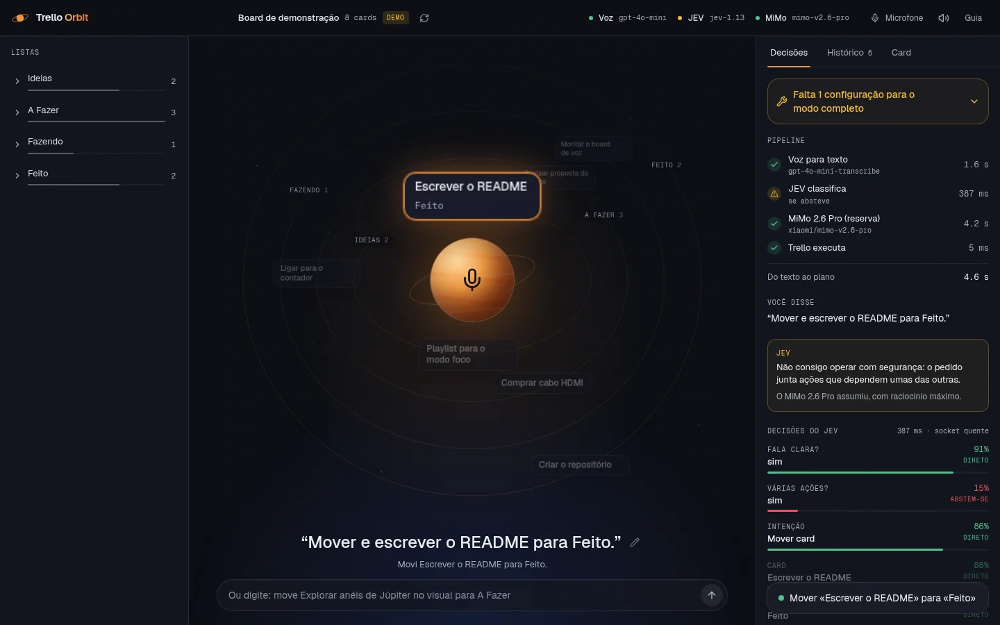

# 🪐 Trello Orbit

**Pilote seu board do Trello por voz.** Você fala → a **OpenAI** transcreve → o **JEV** (modelo
"System One" da TypeSafe, via OpenRouter) decide a intenção (criar, editar, mover, apagar ou listar)
em **~0,4 s** → o app executa pela API do Trello e responde em áudio. Quando a fala traz **várias
ações**, o comando inteiro vai ao **Gemini 3.8 Flash** — o *System Two* do app. **Fora isso não há
reserva genérica**: quando o JEV se abstém ou está indisponível, ele pede que você reformule — nada é
adivinhado.



> O card que você cita **vem para perto** do planeta; ao lado, o painel mostra o pipeline com os
> tempos reais e cada decisão do JEV com a sua confiança.

---

## Índice

- [O que ele faz](#o-que-ele-faz)
- [JEV decide os comandos simples — sem fallback genérico](#jev-decide-os-comandos-simples--sem-fallback-genérico)
- [Novidades do upgrade](#novidades-do-upgrade)
- [Upgrade mobile e rede (out/2026)](#upgrade-mobile-e-rede-out2026)
- [Microfone: como funciona e como diagnosticar](#microfone-como-funciona-e-como-diagnosticar)
- [Início rápido (sem nenhuma chave)](#início-rápido-sem-nenhuma-chave)
- [Configuração completa (.env)](#configuração-completa-env)
- [Credenciais passo a passo](#credenciais-passo-a-passo)
- [Comandos de voz](#comandos-de-voz)
- [API do servidor](#api-do-servidor)
- [Design, animações e acessibilidade](#design-animações-e-acessibilidade)
- [Estrutura do repositório](#estrutura-do-repositório)
- [Testes e verificação](#testes-e-verificação)
- [Publicação sem vazar credenciais](#publicação-sem-vazar-credenciais)
- [Segurança](#segurança)
- [Solução de problemas](#solução-de-problemas)
- [Licença](#licença)

---

## O que ele faz

### Fluxo completo

1. **Você toca no planeta** (ou aperta `Espaço`) e fala. O app **para de ouvir sozinho** quando você
   termina (detecção de fala) e envia só o trecho com voz.
2. A **API STT da OpenAI** transcreve (`gpt-4o-mini-transcribe`), recebendo o nome das suas listas e
   cards como dica de vocabulário.
3. O **JEV** classifica **a intenção (classe CRUD: listar, criar, editar, mover, apagar)** junto com o
   card, a lista e as guardas ("é uma ação só?", "a fala está clara?") — e, na mesma chamada, **uma
   pergunta por coluna** que aprova ou corta colunas. Código determinístico extrai o que o JEV não gera
   (títulos, datas).
4. Se a fala traz **várias ações** («move A para terminado, move B para terminado e move C para
   fazendo»), o comando inteiro vai ao **System Two** (`google/gemini-3.8-flash` no OpenRouter), que
   devolve o plano com **2..N ações** de uma vez; nesse caminho o JEV nem chega a ser consultado.
5. Se a intenção é **listagem**, a cascata continua: as colunas aprovadas viram candidatas e o JEV
   avalia os **cards em lotes de 16** («este card deve ser listado?»), com ressalva *talvez* para os
   duvidosos. Se é **criar/editar/mover/apagar**, o plano sai em **~0,4 s**, montado por código.
6. **Mover, prazo, comentar…** executam direto quando a confiança é alta; confiança média pede um
   ok; **criar/apagar sempre confirmam** (apagar só segurando o botão). **Listagem nunca confirma**:
   só responde. Você pode confirmar **por voz** («sim», «cancela»): o JEV classifica a resposta.
7. Se o JEV **se abstém** (confiança < 50%, fala ininteligível, card ambíguo) ou fica
   **indisponível**, ele **não passa a vez a ninguém**: a tela mostra o motivo, o app pede que você
   reformule e **nada é executado**. A exceção é o comando com várias ações, que vai ao System Two —
   e, se o Gemini falhar, o fluxo volta ao JEV.
8. O servidor aplica na **API REST do Trello** (ou num board demo) e o app responde em áudio.

Tudo funciona **sem chaves**: o app degrada com elegância (STT do navegador · interpretador local
pt-BR · board de demonstração) e mostra no painel exatamente o que falta.

### Ações suportadas na API do Trello

| Ação | Com a voz | Confirmação? |
|---|---|---|
| Criar card (nome, lista, descrição, prazo, etiquetas) | «cria card X na lista Y com prazo amanhã» | ✅ sempre |
| Apagar card (definitivo) | «apaga o card X» | ✅ sempre (hold-to-confirm) |
| Mover card entre listas | «move X para fazendo» | não (narra e executa) |
| Editar card (nome, descrição, etiquetas) | «renomeia X para Y» / «coloca etiqueta urgente em X» | não |
| Definir/remover prazo (+ concluir prazo) | «coloca prazo sexta no card X» | não |
| Comentar no card | «comenta revisado no card X» | não |
| Arquivar card | «arquiva o card X» | não |
| Criar lista | «cria lista chamada Espera» | não |
| Adicionar item a checklist | «adiciona revisar contrato ao checklist de X» | não |
| Consultar/listar cards | «o que eu tenho para fazer?» / «o que há em Fazendo?» | — (só responde; nunca confirma) |

O servidor também expõe **`GET /api/trello/boards`** (lista seus boards, útil para achar o
`TRELLO_BOARD_ID`) e trata erros da API do Trello com códigos claros
(`trello_unauthorized`, `trello_not_found`, …).

> Uma fala pode pedir **várias dessas ações de uma vez** («move A para fazendo, apaga B e cria um card
> C»): aí quem planeia o comando inteiro é o **System Two** (Gemini 3.8 Flash) — veja
> [JEV decide os comandos simples](#jev-decide-os-comandos-simples--sem-fallback-genérico).

---

## JEV decide os comandos simples — sem fallback genérico

O **JEV** não é um LLM: é um modelo *System One* que recebe um texto + perguntas tipadas e devolve
**decisões com probabilidades calibradas**, sem gerar texto. As perguntas de uma chamada são avaliadas
**em paralelo dentro do modelo** (~0,4 s no total, ~US$ 0,0001 por comando). Por isso cada cláusula do
comando vira **uma** requisição de fase 1 (mais os lotes, só quando é listagem), nunca uma cadeia de
raciocínio:

| Pergunta (tipo) | Para quê |
|---|---|
| **Intenção** (`choice`, classe CRUD: listar, criar, editar, mover, apagar + `other`) | decide o que fazer |
| **Card** (`choice` entre os cards abertos do board, ≤ 255) | resolve "o contador" → *Ligar para o contador* |
| **Lista** (`choice` entre as listas) | destino de mover / onde criar |
| **Coluna «X»** (`noul`, **uma por coluna aberta**) | portão de colunas da listagem: a coluna pode responder ao pedido? |
| **Fala clara?** · **Várias ações?** (`noul`) | *guardas*: só bloqueiam, nunca pedem confirmação por incerteza leve |

Não existe mais `query_kind`: **toda** consulta é listagem e passa pela cascata.

**A cascata** (só quando a intenção é listar):

```
fase 1  intenção + card + lista + guardas + 1 noul por coluna
          │
fase 2  p ≥ JEV_COL_INCLUDE (0,35) passa · a poda é PULADA em consultas de
        prazo/semana ou boards pequenos (≤ 2 lotes) · nenhuma passou? passam
        TODAS (recall-first — o estágio fino não recupera o que foi cortado)
          │
fase 3  cards das colunas aprovadas, em lotes de JEV_CARD_BATCH (16),
        1 noul por card («este card deve ser listado?»), lotes em paralelo
          │
        p ≥ 0,50 listado · p ≥ 0,35 listado com ressalva «talvez» · abaixo disso fora
```

O que o JEV **não** faz fica com código: título do card, datas ("dia 20", "semana que vem"), o prazo
relativo do card na pergunta (`ATRASADO` · `vence HOJE` · `vence em N dias` · `concluído`), texto de
comentário e a fala da listagem (agrupada por coluna, com «e mais N»). Falas com **várias ações**
(*«move A para fazendo, apaga B e cria C»*) não passam por aqui: o comando inteiro vai ao **System
Two**, que devolve o plano completo — o JEV fica com os comandos de uma ação.

**Bandas de confiança** (`JEV_AUTO_THRESHOLD`, padrão 0,80): `auto` executa · `hitl` (0,50–0,79) pede um
ok · `abstain` (< 0,50) **não delega a ninguém**. Criar e apagar confirmam sempre; **listagem nunca
confirma** (é só leitura) e é *recall-first*: na dúvida o card entra com a ressalva «talvez», porque
omitir um card que interessa seria o único erro grave. Sem **fallback genérico**, abstenção ou
indisponibilidade (créditos, rede, 5xx) viram a mesma resposta honesta: **o motivo aparece na tela e o
app pede que você reformule** — nenhuma ação é executada por adivinhação. A única exceção é o
**comando com várias ações**, que vai ao System Two; se o Gemini falhar, o fluxo volta ao JEV.

O `/api/agent?stream=1` transmite eventos (SSE): o veredito da fase 1 chega em ~0,5 s, enquanto a
cascata de cards (3 lotes em paralelo para ~40 cards) e o plano final ainda correm — ~0,7–1 s a mais
numa listagem. Num **comando com várias ações** não há evento `jev` (ele nem é consultado): o plano
chega com `provider: "llm"` e `trace.llm`.

### System Two: quando a fala tem várias ações

*«Move A para terminado, move B para terminado e move C para fazendo»* não é um comando para o JEV: é
um plano. Quem o monta é o **Gemini 3.8 Flash** (`google/gemini-3.8-flash` no OpenRouter), o *System
Two* do app — numa só chamada devolve **2..N ações** na ordem certa, e o
`OPENROUTER_REASONING_EFFORT` controla quanto ele pensa antes de responder. É o **único** papel do LLM
no pipeline; no futuro ele também gera texto (nome, descrição, "motivações") em criar/editar.

No painel de **Decisões** aparece o bloco **«Comandos simultâneos»** com o modelo, o número de ações e
o tempo; se o Gemini falhar, o motivo fica ali e o JEV assume o comando.

**Calibração** (`npm run eval:jev`, usa o board demo e chamadas reais): o eval cobre CRUD **e
listagens** (casos com `listingIncludes`/`listingExcludes`) e falha (**exit 1**) se houver alguma ação
errada **ou** algum card esperado faltar na listagem. Rode-o sempre que mexer nas perguntas em
`services/jev-planner.js`.

---

## Novidades do upgrade

Cinco capacidades novas no fluxo, todas verificadas ponta a ponta:

- **Melhor voz dinâmica (OpenRouter)** — com `OPENROUTER_MODEL=auto` (padrão) o app descobre a melhor
  voz disponível em `GET /api/v1/models`: o score é
  `benchmarks.artificial_analysis.intelligence_index` (empate: `agentic_index`, depois preço), dentro
  dos tetos `OPENROUTER_MAX_PROMPT_PRICE`/`OPENROUTER_MAX_COMPLETION_PRICE` (USD por 1M tokens;
  vazios = sem limite de custo). Variantes `:batch` são descartadas. Se a descoberta falhar, vale o
  **fallback fixo** `OPENROUTER_MODEL_FALLBACK` (padrão `google/gemini-3.8-flash`), e a escolha fica
  em cache por `OPENROUTER_MODEL_TTL_MINUTES` (padrão `60`). Em **404/503** do modelo escolhido, o
  cache zera e o app **re-resolve uma vez**. Hoje o `auto` escolhe **`anthropic/claude-opus-5.5`** ao
  vivo.
- **Histórico de sessão** — o front gera um `sessionId` **por carregamento de página** e o envia com
  cada comando, junto do histórico da sessão (**≤ 20 turnos, 500 caracteres cada**). É **só memória**:
  nada em `localStorage` — refresh = sessão nova, por design. O servidor injeta esses turnos como
  **mensagens reais entre o system e o comando atual** e usa o mesmo `sessionId` como `session_id` do
  JEV. É o que permite dizer *«o último pedido»* e voltar a cards citados em turnos anteriores.
- **Busca por características** — *«quais atividades têm comentários sobre pagamento?»* não é
  listagem para o JEV: um **pre-router determinístico** leva o comando ao **System Two**, que emite
  `search_cards` — busca por texto em **nome + descrição + comentários + etiqueta + lista** (termos em
  **AND**, tolerante a acentos, pontuação e emoji, com *score*) e filtros estruturais (**lista**,
  **etiquetas TODAS**, **prazo** `any`/`set`/`none`/`overdue`/`today`/`week`, **arquivados**). O
  resultado chega no payload SSE como `listing` + `search: {query, count}` e **não pede confirmação**
  (é só leitura).
- **Última pesquisa acionável** — todo comando que lista (a busca **ou** a cascata do JEV) guarda os
  ids no *session-store* (**TTL 6 h, LRU de 500 sessões**). O comando seguinte pode dizer *«essas
  atividades»*, *«os da última pesquisa»*, *«todos eles»*: o planner expande `@lastSearch` (ou a
  expressão «última pesquisa») em **N ações concretas**. Sem pesquisa anterior ou com pesquisa vazia,
  os avisos são **distintos**, em pt-BR.
- **Multi-ações heterogêneas** — um comando pode disparar várias ações **completamente diferentes**
  (*editar a descrição + marcar o prazo + comentar*, em cards distintos): o planejador LLM devolve
  **todas na ordem falada** (regra 6 do prompt) e o executor continua a confirmar apenas
  **criar/apagar**.

---

## Upgrade mobile e rede (out/2026)

Captura, transporte e interface endurecidos para uso no celular — tudo verificado ponta a ponta:

- **Captura de áudio em lote comprimida** — o áudio sobe via `MediaRecorder` em
  **`audio/webm;codecs=opus` @ 32 kbps** (Android e Safari 18.4+) ou **`audio/mp4` AAC** no iOS < 18.4;
  sem `MediaRecorder` (ou no modo **áudio bruto**) segue o **WAV 16 kHz mono** legado. São **~40 KB por
  10 s** contra **~320 KB** no WAV. O **VAD/dead-mic continua no tap do worklet**, na mesma stream, e o
  upload é **um único POST multipart** — nunca streaming de micro. O `stopRecorder` tem **teto de 2 s**,
  então o microfone **nunca fica vivo**, e o `/api/stt` aplica **piso mínimo por formato**: **400 B**
  comprimido, **1500 B** WAV.
- **Resiliência de rede no cliente** — o SSE tem **idle-timeout de 45 s**, reiniciado a cada chunk
  (inclusive os `: ping`), com **≤ 3 tentativas** e queda para **fallback não-streaming** com prazo
  próprio de **150 s**; defeitos locais são **definitivos** (`sse_parse_error`/`sse_listener_error`,
  sem re-planejar). O upload do STT tem prazo de **150 s** e **1 retry só para falha de rede**. O
  `/api/agent` emite heartbeat **`: ping` a cada 15 s**, que mantém o stream vivo no corte de ociosidade
  (~100 s) da edge.
- **UI mobile** — alvos de toque **≥ 44 px** (enviar, microfone, cancelar, confirmar, refresh, mute,
  reenviar e menu do microfone), **safe-area insets** no dock e teclado tratado por `visualViewport`
  com *lift* limitado. A geometria do orbit é orçada pelo **estado real** dos cards: **sem clipping a
  partir de 340 px** de largura e **byte-idêntica a partir de 720 px**.
- **Gate do túnel** — se a rota publicada responder **401**, o que falta é o **TOTP** (a menção antiga
  a `?key=` foi removida do código).

---

## Microfone: como funciona e como diagnosticar

A captura grava **comprimida em lote** (detalhes na seção
[Upgrade mobile e rede](#upgrade-mobile-e-rede-out2026)): `MediaRecorder` em
**`audio/webm;codecs=opus` @ 32 kbps** (Android e Safari 18.4+) ou **`audio/mp4` AAC** no iOS < 18.4 —
**~40 KB por 10 s** contra ~320 KB do WAV. O **WAV 16 kHz mono** continua como caminho de recurso
(modo **áudio bruto** ou navegador sem `MediaRecorder`), capturado como **PCM via AudioWorklet**; o
**VAD vem do tap do worklet, na mesma stream**, e o upload é **um único POST multipart**.

- **Para sozinho**: detecção de fala com piso de ruído calibrado (um ventilador constante vira
  "fundo", não "fala"). Fala e ~1,1 s de silêncio encerram a gravação.
- **Aparas e ganho**: só o trecho com voz sobe (menos bytes, STT mais rápido) e microfones baixos
  ganham até 10× de volume.
- **Diz por que falhou**: dispositivo mudo (*«O microfone «X» não captou som»*), sem fala, permissão
  negada, microfone em uso. Gravação muda **nem chega à OpenAI**.
- **Menu do microfone** (barra superior): escolha o dispositivo, ative **áudio bruto** (sem
  cancelamento de eco/ruído) e use o **medidor de nível ao vivo** para ver se ele capta algo.
- **Duas vias de transcrição**: a legenda ao vivo do navegador (quando existe) aparece enquanto você
  fala e vira reserva se a OpenAI falhar.
- **Atalhos**: `Espaço` fala/para · `Esc` cancela · `Enter` confirma (apagar exige segurar o botão).

---

## Início rápido (sem nenhuma chave)

Requisitos: **Node.js 20+** e npm.

```bash
# 1) dependências
cd server && npm install
cd ../web  && npm install && npm run build

# 2) configuração (pode deixar tudo em branco — modo demo)
cd .. && cp .env.example .env

# 3) subir
cd server && npm start
# ✦ Trello Orbit · http://localhost:8787
```

Abra <http://localhost:8787> — você já verá o board de demonstração em órbita e poderá falar ou
digitar comandos. Nada fica rodando depois que você dá `Ctrl+C`.

Para desenvolver o front com hot reload: `cd web && npm run dev` (Vite na porta 5173, com proxy
para a API em `:8787`).

---

## Configuração completa (.env)

Tudo vive em **um único arquivo** (`/.env`), lido **só pelo servidor**. O `.env.example` documenta os
campos; a tabela abaixo é a referência completa (inclui as variáveis novas da cascata):

| Variável | O que faz | Onde obter |
|---|---|---|
| `PORT` | porta do servidor (padrão `8787`) | — |
| `APP_URL` / `APP_NAME` | atribuição enviada ao OpenRouter | — |
| `OPENAI_API_KEY` | transcrição de voz (STT) | [platform.openai.com/api-keys](https://platform.openai.com/api-keys) |
| `OPENAI_STT_MODEL` | `gpt-4o-mini-transcribe` (padrão), `gpt-4o-transcribe` ou `whisper-1` | — |
| `OPENAI_STT_LANGUAGE` | idioma da transcrição (padrão `pt`) | — |
| `OPENROUTER_API_KEY` | **JEV** (comandos simples) e **System Two** (comandos com várias ações): sem ela o app cai no interpretador local pt-BR | [openrouter.ai/keys](https://openrouter.ai/keys) |
| `JEV_ENABLED` | `false` desliga o JEV (fica só o interpretador local) | — |
| `JEV_MODEL` | padrão `typesafe/jev-1.13` (use `~typesafe/jev-latest` para acompanhar versões) | — |
| `JEV_AUTO_THRESHOLD` / `JEV_HITL_THRESHOLD` | bandas do CRUD: `auto` ≥ 0,80 · `hitl` ≥ 0,50 · abaixo disso o JEV se abstém (e pede esclarecimento) | — |
| `JEV_CARD_BATCH` | cards por chamada na cascata de listagem (padrão `16`, clamp 4–24) | — |
| `JEV_LIST_INCLUDE` | `p` mínimo para **listar** o card (padrão `0.5`) | — |
| `JEV_LIST_MAYBE` | `p` mínimo para listar **com ressalva «talvez»** (padrão `0.35`) | — |
| `JEV_COL_INCLUDE` | `p` mínimo para a **coluna** passar no portão (padrão `0.35`, largo: se nenhuma passar, passam todas) | — |
| `JEV_TIMEOUT_MS` | tempo máximo do JEV antes de responder «indisponível» (padrão `4000`) | — |
| `OPENROUTER_MODEL` | **System Two**: modelo que planeia os comandos com várias ações — `auto` (padrão) escolhe a **melhor voz disponível** em `GET /models` dentro dos tetos de preço; ou fixe um id (ex.: `google/gemini-3.8-flash`) | — |
| `OPENROUTER_MODEL_FALLBACK` | modelo de reserva quando a descoberta automática falha (padrão `google/gemini-3.8-flash`) | — |
| `OPENROUTER_MODEL_TTL_MINUTES` | validade da escolha automática, em minutos (padrão `60`) | — |
| `OPENROUTER_REASONING_EFFORT` | esforço de raciocínio do **System Two**: `max` (padrão) · `xhigh` · `high` · `medium` · `low` · `minimal` · `none` | — |
| `OPENROUTER_MAX_TOKENS` | teto de saída do System Two (inclui os *reasoning tokens*), padrão `16000` | — |
| `OPENROUTER_MAX_PROMPT_PRICE` / `..._COMPLETION_PRICE` | teto de custo opcional (USD por 1M tokens) — vale também para a escolha automática do modelo | — |
| `TRELLO_API_KEY` | chave da API do Trello | [trello.com/power-ups/admin](https://trello.com/power-ups/admin) |
| `TRELLO_API_TOKEN` | token com escopo `read, write` | gerado pelo link "Token" no mesmo painel |
| `TRELLO_BOARD_ID` | qual board controlar | `GET /api/trello/boards` |

**Nenhuma dessas variáveis chega ao navegador.** O front conversa apenas com `/api/*`.

---

## Credenciais passo a passo

**➡️ Tutorial completo guiado (com links, `curl`, troubleshooting e segurança):**
**[`docs/TRELLO-GUIA-COMPLETO.md`](docs/TRELLO-GUIA-COMPLETO.md)** — baseado em pesquisa profunda
com verificação adversarial (evidência em [`pesquisas/trello-setup-api.md`](pesquisas/trello-setup-api.md)).

Guia visual complementar: **[`docs/PROXIMOS-PASSOS.html`](docs/PROXIMOS-PASSOS.html)**.

Resumo do Trello (a parte manual):

1. [trello.com/power-ups/admin](https://trello.com/power-ups/admin) → **New** → dê um nome (ex.: *Trello Orbit*).
2. Menu **API Key** → **Generate a new API key** → isso é o `TRELLO_API_KEY`.
3. Link **Token** logo abaixo → autorize com escopo **read, write** → isso é o `TRELLO_API_TOKEN`.
4. Com key + token no `.env`, chame `curl "http://localhost:8787/api/trello/boards"` e copie o `id`
   do board desejado para `TRELLO_BOARD_ID`.
5. Reinicie o servidor — o selo "modo demo" some do cabeçalho.

---

## Comandos de voz

O JEV entende linguagem natural, inclusive verbos coloquiais (*«põe», «joga», «vai pra», «exclui»*) e
menções parciais (*«o contador»* → *Ligar para o contador*). O interpretador local, último degrau da
escada, cobre a gramática essencial em pt-BR:

| Fale algo como | Resultado |
|---|---|
| «cria um card chamado comprar cabo hdmi na lista a fazer com prazo amanhã» | cria (com confirmação) |
| «apaga o card revisar proposta» | apaga (com confirmação + hold) |
| «move revisar proposta para fazendo» | move |
| «coloca prazo sexta no card revisar proposta» | define prazo |
| «comenta revisado no card revisar proposta» | comenta |
| «arquiva o card comprar cabo hdmi» | arquiva |
| «cria uma lista chamada Espera» | cria lista |
| «o que eu tenho para fazer?» | lista os cards que correspondem, agrupados por coluna |
| «o que há em fazendo?» | cascata: aprova a coluna *Fazendo* e avalia os cards dela |
| «quais cards vencem esta semana?» | cascata por prazo, com ressalva «talvez» nos duvidosos |
| «move revisar proposta para terminado, move comprar cabo para a fazer e cria um card chamado ligar ao contador» | **3 ações numa só fala**: o System Two (Gemini 3.8 Flash) planeia o comando inteiro e o app executa em sequência (criar confirma) |
| «quais atividades têm comentários sobre pagamento?» | **busca por características**: o pre-router manda ao System Two, que emite `search_cards` (nome, descrição, comentários, etiqueta, lista) — só responde, sem confirmar |
| «move essas atividades para terminado» | a **última pesquisa** vira N ações concretas; sem pesquisa anterior (ou vazia) o app avisa o que faltou |

Datas aceitas: *hoje, amanhã, depois de amanhã, semana que vem, sexta(-feira), dia 20, 20/08,
20 de agosto*, com ou sem hora (*«às 18h»*).

> A partir de **duas ações numa fala**, o comando deixa de ser interpretado pelo JEV e passa a ser
> planeado pelo **Gemini 3.8 Flash** (System Two) — é o que permite dizer três movimentos e uma criação
> de uma vez só. O mesmo caminho atende as **buscas por características** (*«quais atividades têm
> comentários sobre pagamento?»*), que o pre-router determinístico manda ao System Two — veja
> [Novidades do upgrade](#novidades-do-upgrade).

> A caixa de texto abaixo do botão aceita os mesmos comandos — alternativa permanente à voz
> (e a razão de o app ser 100% utilizável sem microfone).

---

## API do servidor

| Método | Rota | Descrição |
|---|---|---|
| `GET` | `/api/health` | liveness |
| `GET` | `/api/status` | capacidades ativas + checklist do que falta configurar |
| `GET` | `/api/board` | snapshot do board (cache de 30 s; `?fresh=1` força releitura) |
| `POST` | `/api/warm` | aquece o socket do JEV e o board (chamado quando a gravação começa) |
| `POST` | `/api/stt` | multipart `audio` (WAV/webm/…) → transcrição (OpenAI STT) |
| `POST` | `/api/agent` | `{ transcript, sessionId?, history?[], context? }` → plano `{ speech, actions[], needsConfirmation, provider, band, warning, listing?, search?, trace }`; com `?stream=1` responde em **SSE** (`jev` → `plan`; num comando com várias ações não há evento `jev` e o plano traz `provider: "llm"` + `trace.llm`; numa busca por características o `listing` vem com `search: {query, count}`) |
| `POST` | `/api/confirm` | `{ text }` → `yes` \| `no` \| `unclear` (o JEV classifica o «sim»/«cancela» falado) |
| `POST` | `/api/actions` | `{ actions[], confirmed }` → executa; **428** se criar/apagar sem `confirmed: true` |
| `GET` | `/api/trello/boards` | lista boards (para achar o `TRELLO_BOARD_ID`) |

Contrato de erro estável em todas as rotas:

```json
{ "error": { "code": "missing_openai_key", "message": "…", "hint": "…", "detail": null } }
```

---

## Design, animações e acessibilidade

- **Tela cheia, de verdade**: o palco orbital ocupa **toda a área livre**. Os anéis são elipses que
  vão até as bordas (geometria recalculada a cada resize; cada anel só recebe os cards que cabem na
  sua circunferência, o resto vira um marcador **+N** e fica no trilho de listas).
- **HUD em três zonas**: trilho esquerdo com **todas** as listas e cards · palco com o planeta ·
  trilho direito com **Decisões** (pipeline ao vivo + quem planeou — as perguntas do JEV ou o bloco
  «Comandos simultâneos» do Gemini — e a cascata de listagem com as colunas e as contagens),
  **Histórico** e **Card**. Abaixo de 1280 px o trilho esquerdo vira a aba *Listas*; no celular os
  painéis descem para baixo do palco.
- **Zero re-render por frame**: um único loop `requestAnimationFrame` posiciona todos os cards
  direto no DOM (profundidade: frente maior e nítida, fundo menor e apagado; pausa suave no hover).
- **O card citado vem para perto**: flutua acima do planeta com brilho, enquanto o resto escurece.
  **Criar** nasce do planeta com eco + **confete**; **apagar** dissolve com blur.
- **Confirmação inline**: nada de modal bloqueando a órbita. Apagar usa *hold-to-confirm*.
- **Planeta = botão de gravar**: bandas de Júpiter, reage ao volume da voz e tem um estado por fase
  (ouvindo, pensando, confirmando…).
- **Sistema visual**: um único acento (cobre) sobre azul-noite com grão sutil, **Geist** e Geist Mono
  self-hosted (`@fontsource-variable`), números tabulares, Tailwind v4 com tokens shadcn semânticos
  (`web/src/index.css`) e **Motion UI** (`toast-stack`, `confetti`, `hold-to-confirm`,
  `multi-state-button`, tema em `motion.theme.ts`).
- **Acessibilidade**: `prefers-reduced-motion` congela a órbita (tudo segue legível), `aria-live` no
  estado do fluxo, papéis `tablist`/`alertdialog`/`meter`, foco visível, tudo operável por teclado.

---

## Estrutura do repositório

```
trello-assistant/
├── README.md · LICENSE · .env.example
├── docs/
│   ├── TRELLO-GUIA-COMPLETO.md  # tutorial guiado das credenciais do Trello
│   ├── PROXIMOS-PASSOS.html     # checklist pós-clone
│   └── img/                     # capturas (board demo)
├── pesquisas/                   # dossiê de pesquisa profunda da API do Trello
├── server/
│   ├── src/
│   │   ├── index.js · config.js · lib/{http,errors}.js
│   │   ├── domain/actions.js      # ações, resolução de referências, frases no passado
│   │   ├── routes/api.js          # REST + SSE (/agent?stream=1) + /confirm + /warm
│   │   └── services/
│   │       ├── jev.js             # cliente do JEV (keep-alive, retry curto, erros classificados)
│   │       ├── jev-planner.js     # intenção CRUD, guardas, portão de colunas, lotes de cards
│   │       ├── planner.js         # JEV → System Two (compostos) → local + eventos de progresso
│   │       ├── agent.js           # System Two (Gemini 3.8 Flash) — planeia comandos compostos
│   │       ├── model-picker.js    # melhor voz no OpenRouter (`auto`), cache e fallback
│   │       ├── search-engine.js   # busca por características (texto + filtros estruturais)
│   │       ├── session-store.js   # sessão e última pesquisa (TTL 6 h, LRU 500)
│   │       ├── stt.js             # OpenAI STT (+ vocabulário do board)
│   │       ├── board-cache.js     # cache em memória, patch pós-escrita
│   │       ├── intent.js          # interpretador local pt-BR (sem chave OpenRouter)
│   │       └── trello.js          # REST v1 + board demo
│   ├── evals/commands.json        # casos do eval do JEV (CRUD + listingIncludes/listingExcludes)
│   ├── scripts/eval-jev.mjs       # `npm run eval:jev`
│   └── test/                      # node --test (sem rede)
└── web/
    ├── test/audio.test.ts         # VAD, WAV, reamostragem (node --test)
    └── src/
        ├── App.tsx                # orquestração: voz → JEV/System Two → confirmação → execução
        ├── hooks/useVoiceCapture.ts   # PCM/AudioWorklet, VAD, dispositivos, diagnóstico
        ├── lib/{api,audio,plan,session,speech,types}.ts   # `session.ts`: sessionId + histórico (≤20 turnos)
        └── components/            # OrbitStage, Planet, CommandDock, DecisionPanel, ListRail…
```

---

## Testes e verificação

```bash
cd server && npm test          # offline: domínio, parser, pipeline (perguntas, colunas, lotes, roteamento JEV/System Two)
cd server && npm run check     # sintaxe de todos os módulos
cd server && npm run eval:jev  # calibração do JEV com chamadas reais (precisa de OPENROUTER_API_KEY)
cd web    && npm test          # 83 testes: áudio, cadeia de captura, resiliência de rede e geometria
cd web    && npm run build     # type-check estrito + build de produção
```

Os testes do planner usam um transporte HTTP falso: cobrem paralelismo de cláusulas, bandas,
retry de 503, créditos esgotados e a ausência de fallback genérico (abstenção → `actions: []` +
`warning`), sem gastar nada.

> **Teste de ponta a ponta com microfone falso** (Chrome real, `--use-file-for-fake-audio-capture`):
> veja a seção *Microfone*. Rode-o contra um servidor em **modo demo** (`TRELLO_API_KEY=` vazio):
> comandos como *mover* executam sem confirmação e nunca devem tocar no seu board real.

---

## Publicação sem vazar credenciais

1. `.env` está no `.gitignore` — o repositório pode ser **púbico**.
2. Suba `server/` em qualquer Node host (Render, Railway, Fly.io, VPS): build do front
   (`cd web && npm install && npm run build`) + `npm start` — o servidor já serve o `web/dist`.
3. Preencha as variáveis **no painel do provedor** (mesmos nomes do `.env.example`).
4. **HTTPS é obrigatório** para o microfone fora de `localhost`.
5. Rode o checklist de verificação em [`docs/PROXIMOS-PASSOS.html`](docs/PROXIMOS-PASSOS.html).

---

## Rodar local, sempre ligado (systemd --user)

O app pode ficar como serviço de utilizador: sobe sozinho, reinicia se cair e sobrevive a reboot
(basta o `linger` estar ligado — `loginctl show-user $USER -p Linger` → `yes`).

```ini
# ~/.config/systemd/user/trello-orbit.service
[Service]
WorkingDirectory=/caminho/para/trello-assistant/server
ExecStart=/caminho/absoluto/do/node /caminho/para/trello-assistant/server/src/index.js
Restart=on-failure
RestartSec=3

[Install]
WantedBy=default.target
```

```bash
systemctl --user daemon-reload && systemctl --user enable --now trello-orbit
systemctl --user status trello-orbit        # estado
journalctl --user -u trello-orbit -f        # logs ao vivo
systemctl --user restart trello-orbit       # aplicar mudanças do .env
```

> Use o **caminho absoluto do `node`** — o nvm não está no `PATH` do systemd.

Para publicar num domínio próprio (HTTPS + subdomínio + gate), esta máquina tem a
`cloudflare-agent-skill` (`scripts/expose-port/domain.py up '<url>' --name <label> --gate --persist`)
e a `kluser-me-agent-skill`, que mantém o inventário e a saúde das rotas publicadas.

## Segurança

- **Chaves só no servidor** — o bundle do front nunca recebe nenhuma credencial.
- **Confirmação obrigatória em dois níveis** para criar/apagar: modal no front **e** trava no
  servidor (`428 confirmation_required` se chamarem `/api/actions` sem `confirmed: true`).
- **Custo controlado**: retries com backoff honrando `Retry-After`, timeouts, e teto de preço
  opcional por request no OpenRouter.
- **Tokens revogáveis**: Trello (painel de Power-Ups), OpenRouter e OpenAI (painéis de cada um).

---

## Solução de problemas

| Sintoma | Causa provável | Correção |
|---|---|---|
| `missing_openai_key` no STT | `OPENAI_API_KEY` vazio/sem saldo | preencha a chave ou use o fallback do navegador |
| App em "modo demo" | `TRELLO_*` não preenchido | siga [docs/PROXIMOS-PASSOS.html](docs/PROXIMOS-PASSOS.html) |
| `trello_unauthorized` | key/token inválidos ou revogados | gere novos em [trello.com/power-ups/admin](https://trello.com/power-ups/admin) |
| `trello_not_found` | `TRELLO_BOARD_ID` errado | `curl "localhost:8787/api/trello/boards"` e copie o `id` |
| Microfone não pede permissão | página sem HTTPS (fora de localhost) | publique com TLS |
| *«O microfone «X» não captou som»* | dispositivo errado, mudo ou bloqueado | menu do microfone → escolha outro e use o **medidor de nível**; tente **áudio bruto** |
| *«Não entendi nenhuma fala»* com som captado | falou longe, muito baixo ou nomes difíceis | fale mais perto; os nomes das suas listas/cards já vão como dica ao STT |
| Nomes próprios saem trocados («Nem Láde» por «MemLab») | o STT erra a fonética | corrija o texto pelo lápis da legenda (o JEV pode abster-se: reformule com o nome certo) |
| Muitos comandos pedem confirmação | confiança do JEV em pt-BR entre 0,5 e 0,8 | ajuste `JEV_AUTO_THRESHOLD` (rode `npm run eval:jev` antes de baixar) |
| JEV indisponível (créditos, rede) | `402`/`429`/`5xx` no OpenRouter | **nada assume o plano**: o motivo aparece em «Decisões» e o app pede para reformular (falas com várias ações seguem para o System Two, não para o JEV); veja <https://openrouter.ai/credits> |
| Comando com várias ações demora mais | o System Two (Gemini 3.8 Flash) planeia o comando inteiro antes de executar | normal: o painel mostra «Comandos simultâneos» com o modelo, o número de ações e o tempo |
| «Comandos simultâneos» diz que o Gemini falhou | `402`/`429`/`5xx` no OpenRouter durante o plano composto | o fluxo volta ao JEV; se ele também se abstiver, o app pede para reformular |
| «Não consigo operar» / «Não encontrei nada…» | JEV absteve-se (pedido ambíguo) ou nenhum card passou o limiar | reformule dizendo a lista ou o card; baixe `JEV_LIST_INCLUDE`/`JEV_LIST_MAYBE` se estiver a esconder cards |
| Listagem traz cards a mais | critério largo por desenho (*recall-first*) | os duvidosos vêm marcados «talvez»; suba `JEV_LIST_MAYBE` (até perto de `JEV_LIST_INCLUDE`) para os excluir |
| *«essas atividades»* / *«os da última pesquisa»* não executa nada | não houve pesquisa anterior na sessão, ou ela voltou vazia | faça uma listagem ou busca antes; o aviso em pt-BR diz qual dos dois casos ocorreu |
| 429 do OpenRouter | rate limit | o servidor já retenta com backoff e limita os lotes a 8 em paralelo; aguarde |

---

## Licença

[MIT](LICENSE) — use, mude e publique à vontade.

Feito com OpenAI STT · JEV (TypeSafe) via OpenRouter · API REST do Trello · Motion UI. O **Gemini 3.8
Flash** (System Two) entra quando a fala traz várias ações e, no futuro, gera texto em criar/editar.